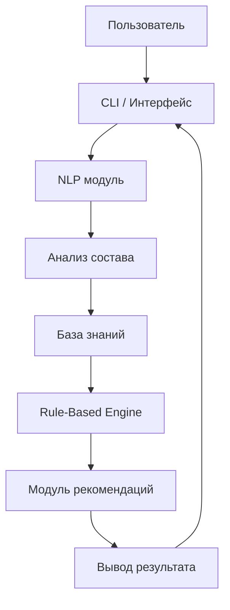

# Intelligent Decision Support System for Dota 2

## 1. Общая характеристика проекта

Данный проект представляет собой интеллектуальную систему поддержки принятия решений (Intelligent Decision Support System, IDSS), предназначенную для помощи игрокам в игре Dota 2 при выборе контр-пиков и предметных рекомендаций.

Проект разработан в рамках курса по интеллектуальным системам и охватывает полный цикл разработки ИС: от формализации знаний и проектирования архитектуры до реализации логики принятия решений и пользовательского интерфейса.

Система не взаимодействует с игровыми серверами и не вмешивается в игровой процесс. Все рекомендации формируются на основе экспертных правил и структурированной базы знаний.

---

## 2. Цель проекта

Разработка MVP интеллектуальной системы, способной:

- анализировать состав вражеской команды;
- формировать рекомендации по контр-пикам;
- предлагать предметные сборки;
- объяснять логику принятого решения.

---

## 3. Тип интеллектуальной системы

Rule-Based Intelligent Decision Support System.

Используемый подход:
- Символьный искусственный интеллект (экспертные правила if–then)
- База знаний в формате JSON и CSV
- Модуль обработки естественного языка (NLP) для разбора запроса

---

## 4. Архитектура системы

Система реализует следующий цикл обработки:

Ввод → Анализ → Принятие решения → Объяснение

### Архитектурная схема



---

## 5. Структура проекта

```
dota-ai-assistant/
│
├── app.py
├── requirements.txt
├── README.md
│
├── data/
│   ├── heroes.json
│   ├── items.json
│   └── counters.csv
│
├── docs/
│   └── architecture.md
│
└── src/
    ├── cli.py
    ├── kb.py
    ├── rules.py
    ├── recommender.py
    ├── nlp.py
    └── demo_nlp.py
```

---

## 6. Реализованные модули

### 6.1 База знаний

Содержит:
- список героев;
- теги (контроль, мобильность, урон и т.д.);
- связи контр-пиков;
- предметные рекомендации.

Форматы хранения: JSON, CSV.

---

### 6.2 Rule-Based Engine

Реализует правила вида:

IF у противника много контроля  
THEN рекомендовать Black King Bar

IF присутствует высокий уклон  
THEN рекомендовать Monkey King Bar

---

### 6.3 NLP-модуль

Обрабатывает текстовый ввод пользователя:

Пример:
"Я саппорт против Storm Spirit и Phantom Assassin"

Извлекает:
- роль
- список врагов
- список союзников
- потенциальные угрозы

---

## 7. Запуск проекта

### 1. Клонирование

```
git clone https://github.com/your_username/dota-ai-assistant.git
cd dota-ai-assistant
```

### 2. Создание виртуального окружения

```
python -m venv .venv
```

### 3. Активация

Windows:

```
.venv\Scripts\activate
```

Linux / Mac:

```
source .venv/bin/activate
```

### 4. Установка зависимостей

```
pip install -r requirements.txt
```

### 5. Запуск

```
python app.py
```

---

## 8. Пример работы системы

Ввод:

```
Я саппорт против Storm Spirit и Phantom Assassin
```

Вывод:

- Рекомендуемые герои
- Предметные рекомендации
- Обоснование выбора

---

## 9. Этапы реализации (Недели 1–6)

| Неделя | Реализация |
|--------|------------|
| 1 | Формализация знаний |
| 2 | Проектирование архитектуры |
| 3 | Создание базы знаний |
| 4 | Реализация Rule-Based Engine |
| 5 | Консольный интерфейс |
| 6 | Добавление NLP-модуля |

---

## 10. Перспективы развития

- Web-интерфейс (Streamlit)
- Улучшенный NLP-анализ
- Computer Vision для распознавания пиков по скриншоту
- Интеграция ML-моделей

---

## 11. Статус проекта

MVP реализован и протестирован.  
Система готова к дальнейшему расширению.


