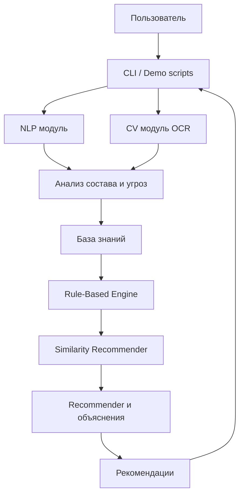

# Intelligent Decision Support System for Dota 2

## 1. Общая характеристика проекта

Данный проект представляет собой интеллектуальную систему поддержки принятия решений (Intelligent Decision Support System, IDSS), предназначенную для помощи игрокам в игре Dota 2 при выборе контр-пиков и предметных рекомендаций.

Проект выполнен в рамках курса по интеллектуальным системам и реализует итеративный подход (сквозной проект по неделям). Система не взаимодействует с игровыми серверами и не вмешивается в игровой процесс. Все рекомендации формируются на основе экспертных правил (rule-based), базы знаний (JSON/CSV), а также методов поиска похожих объектов на основе векторных представлений.

Система ориентирована на помощь пользователю в ситуациях драфта и выбора игровых решений. Она позволяет анализировать состав противника, извлекать информацию из текстового описания или изображения, формировать объяснимые рекомендации и расширять их за счет similarity-based подхода.

---

## 2. Цель проекта

Разработка MVP интеллектуальной системы, способной:

- анализировать состав противника;
- формировать рекомендации по контр-пикам;
- предлагать предметные рекомендации по угрозам;
- обрабатывать текстовый пользовательский ввод;
- извлекать имя героя с изображения;
- находить похожих героев по признаковому представлению;
- объяснять логику принятого решения (explainable output).

---

## 3. Тип интеллектуальной системы

**Hybrid Intelligent Decision Support System**

Используемый подход:

- символьный ИИ (экспертные правила if–then);
- база знаний в формате JSON/CSV;
- NLP-модуль для разбора свободного текста;
- CV-модуль (OCR) для извлечения имени героя с изображения;
- similarity-based рекомендации на основе векторных представлений и cosine similarity.

Таким образом, система сочетает в себе два подхода:

1. **Символьный подход**  
   Используется для объяснимой логики принятия решений:
   - база знаний;
   - экспертные правила;
   - анализ угроз;
   - explainable output.

2. **Векторный подход**  
   Используется для поиска похожих объектов:
   - векторные представления героев;
   - вычисление близости;
   - similarity ranking;
   - recommendation refinement.

Это позволяет рассматривать проект как **гибридную интеллектуальную систему поддержки принятия решений**.

---

## 4. Архитектура системы

Система реализует цикл:

**Ввод → Анализ → Принятие решения → Объяснение**

### Архитектурная схема


```mermaid
flowchart TD
    U[Пользователь] --> UI[CLI / Demo scripts]
    UI --> NLP[NLP модуль]
    UI --> CV[CV модуль OCR]
    NLP --> ANALYZE[Анализ состава и угроз]
    CV --> ANALYZE
    ANALYZE --> KB[База знаний]
    KB --> RULES[Rule-Based Engine]
    RULES --> SIM[Similarity Recommender]
    SIM --> REC[Recommender и объяснения]
    REC --> OUT[Рекомендации]
    OUT --> UI
```

### Общая логика работы системы

Система может принимать данные в нескольких формах:

- структурированный пользовательский ввод через CLI;
- свободный текст через NLP-модуль;
- изображение с именем героя через OCR.

Далее информация передается в модуль анализа, где:

- извлекаются герои;
- распознаются угрозы;
- определяется роль;
- активируются экспертные правила;
- при необходимости используется similarity-модуль для поиска похожих героев.

На выходе пользователь получает:

- список рекомендуемых героев;
- объяснение причин рекомендации;
- предметные советы по угрозам;
- similarity-based related heroes.

---

## 5. Структура проекта (актуальная)

```text
dota-ai-assistant/
│
├── .gitignore
├── app.py
├── requirements.txt
├── README.md
│
├── docs/
│   └── architecture.md
│
├── data/
│   ├── heroes.json
│   ├── items.json
│   ├── counters.csv
│   │
│   ├── Axe/
│   │   └── axe.png
│   ├── Drow_Ranger/
│   │   └── drow ranger.png
│   ├── Ember Spirit/
│   │   └── ember spirit.png
│   ├── Invoker/
│   │   └── invoker.png
│   ├── Lion/
│   │   └── lion.png
│   ├── Mars/
│   │   └── mars.png
│   ├── Morphling/
│   │   └── morphling.png
│   ├── Phantom_Lancer/
│   │   └── phantom lancer.png
│   ├── Riki/
│   │   └── riki.png
│   ├── Shadow Fiend/
│   │   └── shadow fiend.png
│   ├── Storm Spirit/
│   │   └── storm spirit.png
│   └── Terrorblade/
│       └── terrorblade.png
│
└── src/
    ├── __init__.py
    ├── cli.py
    ├── demo_nlp.py
    ├── demo_cv.py
    ├── kb.py
    ├── nlp.py
    ├── rules.py
    ├── recommender.py
    ├── cv_module.py
    ├── similarity.py
    ├── heroes_vectors.py
    ├── pipeline.py
    ├── run_system.py
    └── week8_demo.py
```

### Назначение новых файлов (Weeks 8–10)

- `similarity.py` — вычисление cosine similarity между героями;
- `heroes_vectors.py` — признаки и векторные представления героев;
- `week8_demo.py` — отдельная демонстрация similarity-поиска;
- `pipeline.py` — объединение rule-based и similarity-подходов;
- `run_system.py` — демонстрация единого пайплайна системы.

---

## 6. Реализованные модули (что именно сделано)

### 6.1 База знаний (`data/` + `src/kb.py`)

Содержит:
- список героев и их атрибуты (roles, tags, provides, weak_to, strong_against) — `data/heroes.json`;
- таблицу контр-пиков (counter vs against + score + reason) — `data/counters.csv`;
- словарь “угроза → предметы” — `data/items.json`;
- дополнительный набор изображений героев (для Week 7) — папки внутри `data/`.

Как используется:
- при запуске система загружает JSON/CSV;
- на основе `heroes.json` и `counters.csv` считает скоринг героев;
- на основе `items.json` подсказывает предметы по распознанным угрозам;
- знания используются как основа для символьного reasoning.

---

### 6.2 Rule-Based Engine (`src/rules.py`)

Реализует экспертные правила вида IF–THEN и explainable output.

Примеры логики:
- IF у противника много контроля → THEN рекомендовать предметы типа BKB / Linken (через threats → items);
- IF против Phantom Assassin → THEN повышать кандидатов, которые хорошо контрят PA (через `counters.csv` + rule logic);
- IF команде не хватает disable/frontline/save → THEN повышать героев, которые закрывают потребности.

Выход модуля: не просто “герой”, а **герой + причины**, почему он выбран.

Данный модуль является основой explainable reasoning и отвечает за интерпретируемую часть системы.

---

### 6.3 Recommender (`src/recommender.py`)

Объединяет:
- результаты rule-based оценки кандидатов;
- бонусы контр-пиков из `counters.csv`;
- итоговый скоринг и ранжирование Top-K.

Результат:
- список `Recommendation` (hero, score, reasons, counter_bonus, counter_reason).

Этот модуль формирует основной список кандидатов и обеспечивает итоговую рекомендацию на основании экспертных правил и базы знаний.

---

### 6.4 CLI интерфейс (Week 5) (`src/cli.py`)

Консольный MVP:
- пользователь вводит союзников / противников / роль;
- система выводит Top-K рекомендаций и объяснения.

CLI служит базовым интерфейсом взаимодействия с системой и демонстрирует core-логику проекта без необходимости использования внешнего UI.

---

### 6.5 NLP модуль (Week 6) (`src/nlp.py` + `src/demo_nlp.py`)

Функциональность:
- разбор свободного текста (RU/EN микс);
- распознавание роли (pos5/support/mid/carry/offlane/pos4);
- извлечение героев из текста, включая алиасы (PA → Phantom Assassin, CM → Crystal Maiden и т.д.);
- извлечение угроз (many_stuns, heavy_magic, invis и т.п.);
- выдача предметов по угрозам через `items.json` (в demo).

NLP-модуль позволяет системе работать не только со структурированным вводом, но и с более естественными пользовательскими запросами.

---

### 6.6 Computer Vision (Week 7) — OCR по изображениям (`src/cv_module.py` + `src/demo_cv.py`)

Что сделано на 7-й неделе:
- добавлен модуль обработки изображения через OpenCV + EasyOCR;
- система принимает путь к изображению;
- выполняет OCR и извлекает текст (например “Phantom Lancer”);
- найденные имена сопоставляются с базой знаний (`heroes.json`);
- далее запускается `Recommender` и выдаёт контр-пики.

Этот модуль расширяет систему за пределы обычного текстового ввода и добавляет возможность использовать изображения как источник данных.

---

### 6.7 Similarity модуль (Week 8) — Vector-Based Recommendations (`src/similarity.py` + `src/heroes_vectors.py` + `src/week8_demo.py`)

На восьмой неделе был реализован модуль рекомендаций на основе **векторных представлений объектов и метрики близости**.

Основная идея заключается в том, что каждый герой представляется как **вектор признаков**, описывающих его игровые характеристики.

Примеры признаков:
- carry
- support
- nuker
- disabler
- agility
- strength

Таким образом герой кодируется как:

```text
Hero → Feature Vector
```

Пример:

```text
Phantom Lancer → [1,0,0,0,1,0]
Sven → [1,0,0,1,0,1]
Lion → [0,1,1,1,0,0]
```

Для сравнения героев используется метрика **Cosine Similarity**:

```text
similarity = (A · B) / (|A| * |B|)
```

где:
- `A` и `B` — векторы признаков героев.

Чем ближе значение к **1**, тем более похожи герои.

Функциональность модуля:
- вычисление cosine similarity между героями;
- поиск наиболее похожих героев;
- ранжирование кандидатов;
- демонстрация работы similarity-based рекомендаций.

Пример работы:

```text
Heroes similar to phantom lancer:
1) sven
2) phantom assassin
3) juggernaut
```

Этот модуль добавляет в проект **векторный подход** и расширяет rule-based систему элементами similarity reasoning.

---

### 6.8 Интеграция модулей (Weeks 9–10) — Unified Decision Pipeline (`src/pipeline.py` + `src/run_system.py`)

На девятой и десятой неделях была реализована **интеграция всех ранее созданных модулей в единый pipeline принятия решений**.

Система объединяет:

- NLP-модуль;
- OCR-модуль;
- rule-based reasoning;
- knowledge base;
- similarity recommendations.

Общий пайплайн работы:

```text
User Input
     ↓
Text / Image Processing
     ↓
NLP / OCR Extraction
     ↓
Rule-Based Reasoning
     ↓
Similarity Recommendation
     ↓
Final Recommendation
```

Что делает интеграционный модуль:
- принимает пользовательский ввод;
- определяет, является ли вход текстом или именем героя;
- извлекает роль или конкретного героя;
- запускает rule-based или similarity-based ветку анализа;
- возвращает итоговую рекомендацию.

Таким образом, Weeks 9–10 завершают переход от отдельных модулей к **единой интеллектуальной системе**, где разные подходы взаимодействуют внутри общего decision pipeline.

---

## 7. Установка и запуск (все режимы)

### 7.1 Клонирование

```bash
git clone https://github.com/your_username/dota-ai-assistant.git
cd dota-ai-assistant
```

### 7.2 Виртуальное окружение

```bash
python -m venv .venv
```

**Windows:**
```bash
.venv\Scripts\activate
```

**Linux / Mac:**
```bash
source .venv/bin/activate
```

### 7.3 Установка зависимостей

```bash
pip install -r requirements.txt
```

### 7.4 Запуск режимов

#### A) Основной запуск (если `app.py` подключает CLI)
```bash
python app.py
```

#### B) CLI MVP (Week 5)
Запуск через модуль (из корня проекта):
```bash
python -m src.cli
```

#### C) NLP demo (Week 6)
```bash
python -m src.demo_nlp
```

Пример ввода:
```text
Я саппорт, против Storm Spirit и PA, у врагов много контроля и магии, что пикнуть и что собрать?
```

#### D) CV/OCR demo (Week 7)
```bash
python -m src.demo_cv
```

Дальше программа спросит путь к изображению. Пример:
```text
data/Phantom_Lancer/phantom lancer.png
```

#### E) Similarity demo (Week 8)
```bash
python src/week8_demo.py
```

Пример логики:
- выбирается базовый герой;
- система ищет наиболее похожих героев по cosine similarity;
- выводится ranking similarity candidates.

#### F) Unified pipeline demo (Weeks 9–10)
```bash
python src/run_system.py
```

Пример ввода:
```text
phantom lancer
```

или

```text
I want a carry hero with high damage
```

Далее система:
- распознает роль или героя;
- выбирает базовую рекомендацию;
- выводит похожих героев.

---

## 8. Примеры работы (реальные)

### 8.1 Пример: NLP (Week 6)

Ввод:
```text
Я саппорт, против Storm Spirit и PA, у врагов много контроля и магии, что пикнуть и что собрать?
```

Ожидаемая логика:
- распознаются враги: Storm Spirit, Phantom Assassin;
- распознаются угрозы: heavy_magic, many_stuns;
- выводятся предметы из `items.json`;
- выдаются герои с объяснениями.

---

### 8.2 Пример: CV/OCR (Week 7)

Ввод:
```text
Введите путь к изображению: data/Phantom_Lancer/phantom lancer.png
```

Вывод (пример):
```text
Распознано на изображении:
['Phantom Lancer', '#75']

Определённые герои: ['Phantom Lancer']

Рекомендации:
1) Shadow Shaman | score=11
2) Lion | score=8
3) Dazzle | score=8
4) Oracle | score=8
5) Crystal Maiden | score=8
```

---

### 8.3 Пример: Similarity (Week 8)

Ввод:
```text
Input hero: phantom lancer
```

Вывод:
```text
Heroes similar to phantom lancer
sven 1.0
phantom assassin 0.71
juggernaut 0.5
```

Ожидаемая логика:
- герой преобразуется в вектор признаков;
- вычисляется cosine similarity;
- формируется ранжированный список похожих героев.

---

### 8.4 Пример: Unified Pipeline (Weeks 9–10)

Ввод:
```text
Опишите, какого героя вы хотите: phantom lancer
```

Вывод:
```text
Рекомендуемый герой: phantom lancer
Похожие герои:
sven 1.0
phantom assassin 0.71
juggernaut 0.5
```

Ожидаемая логика:
- система распознает героя из текста;
- запускает similarity-поиск;
- возвращает итоговую рекомендацию и related heroes.

---

## 9. Этапы реализации (Недели 1–10)

| Неделя | Что сделано |
|--------|-------------|
| 1 | Инициализация проекта, структура репозитория, окружение, базовая идея ИС |
| 2 | Проектирование архитектуры, разделение на модули, подготовка документации |
| 3 | Реализация базы знаний (heroes.json, counters.csv, items.json) |
| 4 | Rule-Based Engine: правила, потребности команды, explainable output |
| 5 | CLI MVP: ввод союзников/врагов/роли → рекомендации |
| 6 | NLP: разбор текста, извлечение героев/роли/угроз, items по threats |
| 7 | CV (OCR): обработка изображений героев → извлечение имени → рекомендации |
| 8 | Similarity module: векторные представления героев, cosine similarity, поиск похожих объектов |
| 9 | Интеграция similarity-модуля с rule-based и NLP-логикой |
| 10 | Построение единого decision pipeline, финальная интеграция модулей |

---

## 10. Перспективы развития

- Web-интерфейс (Streamlit) для загрузки текста/изображений через UI;
- улучшение NLP (больше алиасов, устойчивость к ошибкам, более “умное” извлечение);
- расширение OCR: поддержка скриншотов драфта (где сразу 5 героев);
- переход к hybrid AI: добавить ML-модель для ранжирования кандидатов поверх rule-based логики;
- расширение similarity-модуля на большее количество героев и признаков;
- более точная модель векторных представлений на основе игровых ролей и статистики.

---

## 11. Статус проекта

Реализован MVP и расширения до Week 10.

На текущий момент проект включает:

- rule-based систему рекомендаций;
- knowledge base на JSON/CSV;
- NLP-модуль обработки свободного текста;
- OCR-модуль обработки изображений;
- similarity-based рекомендации;
- unified decision pipeline.

Проект демонстрирует применение **гибридных методов искусственного интеллекта** и готов к дальнейшему расширению и улучшению.
